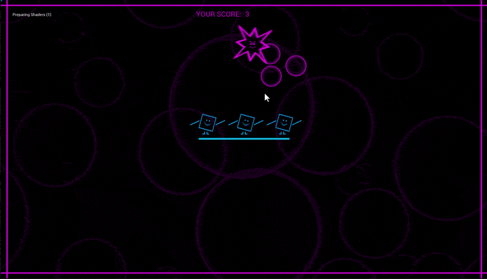

# Cantoni



A casual arcade game developed in **Unreal Engine 5.5.4** that explores gameplay programming, event driven systems, persistent data management, and Blueprint architecture.

The primary goal of this project was to design and implement a complete gameplay loop while building a reusable leaderboard system capable of storing player scores, maintaining rankings, and persisting data across multiple play sessions.

---

## Project Overview

Cantoni is a single level arcade experience where the player must burst bubbles before they reach a group of dancing characters at the center of the scene.

Throughout the match, a creature continuously circles the dancers while spawning bubbles at timed intervals. The player earns points by clicking and bursting each bubble before the game timer expires.

Once the match ends, the player's score is evaluated, inserted into a persistent leaderboard, sorted in descending order, and saved for future sessions.

---

## Technical Summary

| Category | Details |
|----------|---------|
| Engine | Unreal Engine 5.5.4 |
| Programming | Blueprint Visual Scripting |
| Project Type | Single Level Arcade Game |
| UI Framework | Unreal Motion Graphics (UMG) |
| Data Persistence | SaveGame System |
| Ranking Algorithm | Bubble Sort |
| Architecture | Modular Blueprint System |

---

# Gameplay Systems

## Bubble Spawning

Bubble generation is controlled using Unreal Engine's **Set Timer by Event** node.

Instead of spawning continuously every frame, bubbles are generated at fixed intervals for the duration of the game.

The spawning system was designed to maintain a balanced amount of active bubbles on screen, giving players enough breathing space to react without overwhelming them.

Bubble positions are randomized around the moving creature to create variation while maintaining fair gameplay.

---

## Creature Controller

The Creature Blueprint acts as the central controller for the gameplay session.

Its responsibilities include:

* Controlling cyclic movement around the dancers
* Starting gameplay
* Managing timed bubble spawning
* Ending the match
* Computing the final player score
* Triggering leaderboard updates

Since the creature owns the spawning lifecycle, it also serves as the point where the final score is evaluated once gameplay ends.

---

## Bubble Behaviour

Each spawned bubble manages its own behaviour independently.

The Bubble Blueprint is responsible for:

* Wobble animation
* Mouse click interaction
* Self destruction
* Score notification
* Real time score updates

When a bubble is clicked:

1. The bubble destroys itself.
2. A reference to the Score Manager is retrieved.
3. The current score is incremented.
4. The HUD updates immediately.

Keeping this logic inside the Bubble Blueprint keeps gameplay interactions modular and reduces unnecessary dependencies between gameplay actors.

---

# Score System

Runtime score management is handled by a dedicated **Score Manager** Actor Blueprint.

The Score Manager acts as the central source of truth for all score related information during gameplay.

Its responsibilities include:

* Storing the current score
* Updating the HUD
* Receiving score events from bubbles
* Providing score information to other gameplay systems

This separation allows gameplay actors to focus on their own responsibilities while the Score Manager handles all runtime scoring logic.

---

# Persistent Save System

Persistent player data is implemented using Unreal Engine's **SaveGame** framework.

The SaveGame object stores:

* Player Name
* Final Score
* Leaderboard Entry Structure

The leaderboard entry is implemented using a custom Blueprint Structure containing:

* Player Name
* Player Score

Grouping both values into a single structure keeps leaderboard entries organised and simplifies saving and loading player records.

---

# Leaderboard Architecture

The leaderboard system was the primary programming challenge and technical objective of this project.

At the end of every game:

1. The player's final score is packaged into a leaderboard entry.
2. The entry is inserted into the leaderboard array.
3. The array is sorted in descending order.
4. If more than ten entries exist, the lowest ranked score is removed.
5. The updated leaderboard is written back to the SaveGame object.

This ensures that only the ten highest scoring players remain stored between gameplay sessions.

---

## Ranking Algorithm

Leaderboard sorting is implemented using a custom **Bubble Sort** algorithm.

Scores are sorted from highest to lowest before being presented to the player.

Rather than relying on a built in sorting solution, the algorithm was implemented manually as an opportunity to strengthen algorithmic problem solving and Blueprint scripting skills.

---

# User Interface

The user interface is built entirely using Unreal Motion Graphics (UMG).

Features include:

* Real time score display
* Persistent leaderboard
* Custom interface artwork
* Custom button styling
* Particle feedback when buttons are pressed

Several interface assets were designed specifically for the project to create a more playful and cohesive presentation.

---

# Blueprint Architecture

### Creature Blueprint

* Creature movement
* Bubble spawning
* Gameplay timer
* End game flow
* Final score calculation

### Bubble Blueprint

* Bubble movement
* Click interaction
* Score updates
* Self destruction

### Score Manager

* Runtime score storage
* HUD updates
* Score synchronisation

### SaveGame

* Player data persistence
* Leaderboard storage
* Session persistence

---

# Unreal Engine Features Used

* Blueprint Visual Scripting
* Actor Blueprints
* Blueprint Structures
* SaveGame System
* Game Instance
* Timers
* Collision
* Widget Blueprints
* Unreal Motion Graphics (UMG)
* Niagara
* Audio Components
* Input Events

---

# Future Improvements

If I were to continue developing the project, I would focus on expanding both replayability and progression.

Planned improvements include:

* Procedurally generated gameplay layouts
* Multiple difficulty modes
* Separate leaderboards for each difficulty
* Additional creature behaviours
* Dynamic spawn balancing
* Improved visual feedback
* Achievement system
* Additional gameplay modifiers

These additions would allow the existing leaderboard architecture to scale naturally while increasing long term player engagement.

---

# Repository Structure

```
Config/
Content/
Source/
Cantoni.uproject
README.md
```

Generated Unreal Engine folders such as `Binaries`, `Intermediate`, `Saved`, and `DerivedDataCache` are intentionally excluded from source control.

---

# Skills Demonstrated

* Gameplay Programming
* Blueprint System Design
* Event Driven Programming
* Save System Implementation
* Gameplay State Management
* Algorithm Design
* UI Programming
* Data Persistence
* Modular Blueprint Architecture
* Unreal Engine Development

---

# Author

**Temitope S. Falade**

Gameplay Programmer | Technical Animator | Technical Artist

Portfolio  
https://topson-noble.github.io/game-developer/cantoni.html

Game Portfolio  
https://topzone.itch.io/

LinkedIn  
https://www.linkedin.com/in/temitope-falade-578107120/
